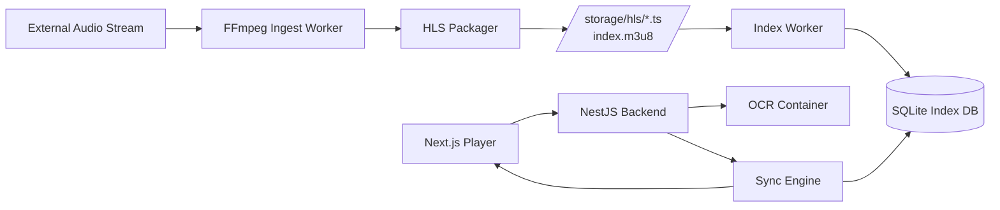

# Low-Latency Audio Streaming – Documentation

# `README.md` 👉 PART 6/6 FOR THE INITIAL PROJECT DOCUMENTATION

- ✔ `README.md`
  - ✔ Complete API specification (REST routes + request/response examples)
  - ✔ DTOs
  - ✔ Error contracts
  - ✔ Operational notes
  - ✔ Full system overview

## **Low-Latency Audio Streaming Platform**

### *Real-time Audio Playback with Scoreboard Synchronization*

---

# **1. Overview**

This project implements a **local, cloud-free simulation** of a real-time audio streaming pipeline similar to AWS MediaLive + MediaPackage.

It enables:

* 🔊 **Low-latency audio streaming** via FFmpeg + HLS
* ⏱️ **Real-time synchronization** between scoreboard photos and audio timeline
* 👁️ **OCR extraction** from scoreboard images
* 🎧 **Web-based audio player** built with Next.js 16 + React 19
* 🧩 **Modular Backend** built with NestJS (DDD architecture)
* 🗂️ **Segment indexing subsystem** for timestamp alignment

This repository provides a **full platform experience locally**, without needing AWS or any paid cloud provider.

---

# **2. Features**

### 🌐 **Next.js (Frontend)**

* LL-HLS audio playback
* Seek ±1.5s and ±10s
* OCR upload flow
* Sync indicator
* Modern React 19 architecture

### 🧠 **NestJS (Backend)**

* OCR processing
* Sync engine
* HLS playlist serving
* Index querying
* Domain-driven modular structure

### 🎛️ **Streaming Pipeline**

* FFmpeg ingest worker
* Local HLS packager
* Segment indexer (SQLite)
* Low-latency playlist generation

---

# **3. Repository Structure**

```
/frontend        → Next.js 16 (React 19)
/backend         → NestJS 11 (DDD Modular Architecture)
/streaming       → FFmpeg ingest + HLS packager + indexer
/storage         → HLS segments + playlist + metadata
/docs            → Confluence-style documentation
```

---

# **4. Architecture Diagram**



---

# **5. Quick Start**

## **Prerequisites**

* Node.js ≥ 20
* Docker
* FFmpeg installed or Dockerized
* pnpm (recommended)

---

## **Clone & Install**

```bash
git clone https://github.com/your-org/audio-sync-platform
cd audio-sync-platform
pnpm install
```

---

## **Start the System**

### 1. Start Streaming Workers

```bash
docker compose up ffmpeg-worker indexer
```

### 2. Start Backend

```bash
cd backend
pnpm start:dev
```

### 3. Start Frontend

```bash
cd frontend
pnpm dev
```

---

# **6. Frontend Overview (Next.js 16)**

The frontend provides:

* Audio player UI
* Image upload for OCR
* Sync request interface
* Realtime latency display

File location:

```
/frontend/app/player/audio-player.tsx
```

Uses:

* hls.js
* React 19 transitions
* Modular hooks: `usePlayer.ts`, `useHls.ts`

---

# **7. Backend Overview (NestJS)**

Domains:

```
/domains
  /ocr        → OCR processing
  /sync       → Sync engine
  /hls        → HLS metadata serving
  /common     → DTOs, guards, exceptions
```

Patterns:

* Domain-driven
* Dependency inversion
* Modules decoupled via interfaces
* DTO validation via `class-validator`
* Exception filters

---

# **8. Streaming Pipeline (FFmpeg + Indexer)**

Pipeline steps:

1. Pull remote audio stream
2. Normalize via FFmpeg
3. Generate 2-second HLS segments
4. Store in `/storage/hls`
5. Indexer monitors folder & records timestamp metadata
6. Sync Engine uses metadata to determine seek positions

More details in `docs/streaming_pipeline.md`.

---

# **9. OCR + Sync Flow**

1. User uploads scoreboard image
2. Backend sends to OCR container
3. OCR extracts `{home, away, clock}`
4. User confirms data
5. Frontend sends sync request
6. Backend maps clock → audio timestamp
7. Player seeks to target timestamp

More details in `docs/ocr_sync.md`.

---

# **10. API Specification**

Below is the full REST API contract used by the frontend.

---

# **API SPECIFICATION**

## **Base URL**

```
http://localhost:3000/api
```

---

# **11. Endpoints**

---

## **POST /ocr**

Extract scoreboard metadata from an uploaded image.

### Request:

**Multipart FormData**

| Field   | Type | Required |
| ------- | ---- | -------- |
| `image` | File | Yes      |

### Response:

```json
{
  "home": 85,
  "away": 79,
  "clock": "08:12",
  "period": 4,
  "confidence": 0.92
}
```

### Error Responses

```json
{ "error": "OCR_UNCERTAIN", "confidence": 0.55 }
```

---

## **POST /sync-score**

Given scoreboard metadata, return audio timestamp alignment.

### Request:

```json
{
  "home": 85,
  "away": 79,
  "clock": "08:12",
  "period": 4
}
```

### Response:

```json
{
  "timestamp": 491.8,
  "segment": "segment246.ts",
  "offset": -2.3,
  "applyImmediately": true,
  "confidence": 0.91
}
```

---

### Error Responses

```json
{ "error": "NO_MATCH_FOUND" }
```

```json
{ "error": "INVALID_CLOCK" }
```

---

## **GET /hls/playlist**

Retrieve the current HLS playlist.

### Response:

```
#EXTM3U
#EXT-X-VERSION:7
#EXT-X-TARGETDURATION:2
#EXT-X-MEDIA-SEQUENCE:200
...
```

---

## **GET /hls/segment/:id**

Serves HLS segments.

---

## **GET /index/segment/:seq**

Retrieve timestamp metadata for a specific segment.

### Example:

```json
{
  "sequence": 201,
  "filename": "segment201.ts",
  "start": 400.0,
  "end": 402.0,
  "duration": 2
}
```

---

# **12. DTOs**

### OCR DTO

```ts
export class OcrDto {
  image: Express.Multer.File;
}
```

---

### Sync DTO

```ts
export class SyncScoreDto {
  home: number;
  away: number;
  clock: string;   // MM:SS
  period?: number;
}
```

---

# **13. Error Handling Contract**

All errors follow:

```json
{
  "error": "ERROR_CODE",
  "message": "Human readable message"
}
```

Common codes:

| Code             | Meaning                      |
| ---------------- | ---------------------------- |
| `OCR_UNCERTAIN`  | OCR confidence < 0.75        |
| `INVALID_CLOCK`  | Clock not in MM:SS format    |
| `NO_MATCH_FOUND` | No index entry matches clock |
| `INDEX_DB_ERROR` | SQLite unavailable           |

---

# **14. Development Workflow**

### Step 1 — Start streaming pipeline

### Step 2 — Start backend

### Step 3 — Start frontend

### Step 4 — Upload scoreboard image

### Step 5 — Sync + Playback

### Step 6 — Adjust modules if needed (DDD makes this easy)

---

# **15. Production Considerations**

* HLS segments should be moved to S3 or CDN
* OCR container can be replaced by GPU-powered service
* Sync engine may move to microservice for scalability
* Frontend should prefetch playlist for faster startup
* Security:

  * Rate limit OCR uploads
  * Validate MIME types
  * Use signed URLs for segments if cloud-based

---

# **END OF FILE — README.md & API Specs**

---
===============================================================
---
===============================================================
---


