# Architecture Overview

## System Diagram
...


# ✅ **WE ARE BUILDING ARE 100% LOCALLY (NO CLOUD PROVIDER NEEDED | BASED ON AWS SERVICES)**

## **1. Ingestion + Re-Streaming Server (MediaLive Simulation)**

**AWS MediaLive → local equivalent:**

✔ **FFmpeg** running inside a Docker container  
✔ **Nginx + RTMP module** to receive and redistribute the stream  
✔ **HLS generator** (via FFmpeg or Nginx)

### This enables us to:

* Receive any external audio URL
* Reprocess or resegment the stream
* Generate low-latency HLS (LL-HLS if desired)
* Re-expose it over local HTTP

---

### **2. “Local MediaPackage” for HLS Packaging**

### In AWS MediaPackage you:

* create playlists,
* manage buffering,
* generate optimized manifests.

### Locally, we mimic this with:

✔ **hls.js** on the frontend  
✔ **FFmpeg + custom segmentation scripts**  
✔ **A lightweight Node.js server that builds dynamic manifests**

### This “mini local MediaPackage” can:

* create 5-minute playlist windows
* tune **EXT-X-TARGETDURATION**
* shrink 6s segments → 2s for lower latency
* generate sub-playlists for 1.5s and 10s rewinds

---

## **3. Audio Indexing (simulating EC2 + FFmpeg + Worker)**

**We can run:**

✔ **A Worker container** that receives the live stream  
✔ Processes it with FFmpeg  
✔ Builds timestamp indexes for later synchronization  
✔ Stores everything in SQLite or JSON files

---

## **4. Full Backend API (Node.js / NestJS or Fastify)**

Running in Docker:

* endpoint to start ingest
* endpoint to return the playlist
* endpoint to fetch the nearest timestamp
* endpoint to sync audio with the detected score

---

## **5. React Native + Expo Frontend (Local)**

Yes—**Expo can run locally** and consume the HLS produced by the containers.

**Capabilities:**

* ✔ Play;
* ✔ Pause;
* ✔ Seek -10s;
* ✔ Seek -1.5s;
* ✔ Waveform visualization (optional);
* ✔ Stability testing for low-latency playback;

---

## **6. OCR + Computer Vision to Detect Score/Time (Simulating the Client Backend)**

**We can do this locally with:**

✔ **Tesseract.js or Tesseract-ocr** (pure local OCR)  
✔ **OpenCV.js** to locate scoreboard regions  
✔ **Expo frontend takes a photo → sends to backend → backend runs OCR**

### Results:

* detected score
* game time
* backend queries the audio index
* returns the correct timestamp
* audio jumps to the exact position

---

# 🚀 **Complete Architecture Running Locally (AWS Simulated Version)**

Here is the “AWS, but local” view:

```sh
┌─────────────────────────────────────────────────────┐
│                 External Audio Source               │
└─────────────────────────────────────────────────────┘
                           │
                           ▼
┌─────────────────────────────────────────────────────┐
│  Docker: NGINX+RTMP / FFmpeg Ingest (MediaLive)     │
│  - Recebe stream                                    │
│  - Re-encode                                        │
│  - Segmenta HLS (2s, LL-HLS opcional)               │
└─────────────────────────────────────────────────────┘
                           │
                           ▼
┌─────────────────────────────────────────────────────┐
│  Docker: Node.js HLS Packager (MediaPackage local)  │
│  - Gera playlists M3U8 dinâmicas                    │
│  - Mantém janela de 5 min                           │
│  - Indexa timestamps                                │
└─────────────────────────────────────────────────────┘
                           │
                           ▼
┌─────────────────────────────────────────────────────┐
│ Docker Worker: FFmpeg Indexer (simula EC2 worker)   │
│ - Analisa áudio                                     │
│ - Cria metadata JSON/SQLite                         │
└─────────────────────────────────────────────────────┘
                           │
                           ▼
┌─────────────────────────────────────────────────────┐
│  Backend API (NestJS/Fastify)                       │
│  - /sync-score                                      │
│  - /get-playlist                                    │
│  - /seek                                            │
│  - /ocr                                             │
└─────────────────────────────────────────────────────┘
                           │
                           ▼
┌─────────────────────────────────────────────────────┐
│ React Native + Expo Video Player                    │
│  - Reproduz LL-HLS                                  │
│  - Botões ±1.5 / ±10                                │
│  - Faz upload da foto do placar (OCR)               │
└─────────────────────────────────────────────────────┘
```

---

# 🧪 **What You Can Validate Locally (Almost Production-Like)**

### **✓ Real Player Latency**

**You can measure:**

* 6s segments → ~17s latency
* 2s segments → ~6s latency
* 1s segments → ~3–4s latency
* LL-HLS → potentially <2s in Expo Video (depending on support)

### **✓ HLS Stability with Seeking**

**Test locally:**

* Seek -1.5s
* Seek -10s
* Rapid jumps
* Full buffer vs. empty buffer

### **✓ OCR Synchronization**

**Simulate the real workflow:**

* take a photo of the scoreboard on TV
* backend extracts score/time
* backend finds the closest timestamp
* frontend repositions audio

### **✓ Stress Test**

**We can run:**

* 200 simultaneous connections
* continuous re-streaming
* segment cleanup routines

All of this **locally**, without spending a cent.

---

# 🛠️ **Recommended Tools for the Local Stack**

### **Streaming / HLS**

* `ffmpeg`
* `nginx-rtmp-module`
* `hls.js` (for web tests)
* Segments: 2s, 1s, 500ms

### **Infrastructure**

* Docker
* Docker Compose
* Node.js (NestJS or Fastify)

### **OCR**

* `tesseract-ocr`
* `opencv4nodejs`

### **Mobile**

* Expo Go
* Expo AV / Expo Video

---

# 🧱 **Local MVP: What You Can Build in 1–2 Weeks**

### **Backend**

✔ An endpoint `/start-stream`  
✔ Local stream converted to HLS  
✔ Dynamically generated HLS playlist  
✔ Timestamp indexing  
✔ `/sync-score` using OCR

### **Mobile Frontend**

✔ Player using Expo Video  
✔ Seek buttons  
✔ Upload scoreboard photo

### **Infrastructure**

✔ Compose with 3 services:

* ingest
* packager
* backend

---

# 🧠 **End Result: A Local Replica of the AWS Architecture**

No AWS costs.  
No testing limits.  
Full control over latency, processing, and the player.

Perfect for:

* study
* portfolio
* demos
* interviews
* becoming a mini product

---

## 📁 **Files Included in the Package**

The folder contains the following Markdown documents (Confluence style):

| File                      | Description                                                                 |
| ------------------------- | --------------------------------------------------------------------------- |
| **README.md**             | Project overview, system goals, and documentation summary                   |
| **architecture.md**       | Complete architecture, flows, explained diagrams, components                |
| **backend.md**            | Backend documentation (endpoints, workers, ingest, indexing, etc.)          |
| **streaming_pipeline.md** | Streaming pipeline (FFmpeg, HLS, LL-HLS, segmentation, manifests)           |
| **frontend.md**           | Expo/React Native player architecture, seeking logic, sync loop             |
| **ocr_sync.md**           | OCR pipeline, scoreboard sync, matching algorithm                           |
---

---
===============================================================
---
===============================================================
---

---


# `architecture.md`

**Part 1/6**: the **full and complete `architecture.md`** in English, written in a **professional, Confluence-style documentation format**, with diagrams (Mermaid-friendly), detailed explanations, flows, components, and responsibilities.

## **Low-Latency Audio Streaming Platform – Architecture Documentation**

---

# **1. Overview**

This document provides a detailed architectural specification of the **Local Low-Latency Audio Streaming Platform**, a simulation of a production-grade system similar to AWS MediaLive + MediaPackage + custom synchronization services.

The system enables:

* ingesting an external audio stream,
* re-encoding and segmenting it locally,
* generating HLS playlists with low latency,
* indexing audio timestamps for synchronization,
* exposing an API for seeking (±1.5s / ±10s),
* synchronizing playback based on OCR scoreboard detection,
* delivering the final stream to a React Native client.

The architecture is fully containerized using **Docker**, allowing the entire platform to run locally on a developer machine (e.g., MacBook M4 Max).

---

# **2. High-Level System Architecture**


---

# **3. Architectural Principles**

1. **Local-first simulation of cloud media pipelines**
   All components mimic real AWS services but run locally.

2. **Separation of concerns**

   * ingest
   * encoding
   * packaging
   * indexing
   * metadata management
   * synchronization
   * playback

3. **Scalable by design**
   Although running locally, all services can be deployed to containers, serverless infrastructure, or Kubernetes.

4. **Modular microservice ecosystem**
   Each component is replaceable and can be independently optimized.

---

# **4. Components Breakdown**

## **4.1 Ingest Service (MediaLive local equivalent)**

**Purpose:**
Accept external audio streams and convert them into a low-latency HLS-compatible format.

**Technologies:**

* FFmpeg
* Nginx + RTMP Module
* Docker container

**Responsibilities:**

* Connect to remote MP3/AAC/ICECAST or any HTTP audio source
* Re-encode audio to AAC (if needed)
* Segment audio at **1s–2s intervals**
* Push segments into the Packaging Service directory

**Output:**
`segment000.ts`, `segment001.ts`, …
`master.m3u8`

**Key Flags (example):**

```
ffmpeg -i <URL> \
  -c:a aac -b:a 128k \
  -f hls \
  -hls_time 2 \
  -hls_list_size 300 \
  -hls_flags delete_segments+append_list \
  /hls/output.m3u8
```

---

## **4.2 HLS Packager Service (MediaPackage local equivalent)**

**Purpose:**
Generate and manage dynamic `.m3u8` manifests, handle buffer windows, and provide stable HLS output.

**Technologies:**

* Node.js / Fastify or Golang
* Custom manifest builder
* Local storage or shared Docker volume

**Responsibilities:**

* Maintain rolling playlist window
* Generate master + media playlists
* Ensure segment consistency
* Validate timestamps
* Provide endpoints for seeking and retrieving specific segments

**Outputs:**

* `/hls/live.m3u8`
* `/hls/{timestamp}.m3u8` (optional windows)

---

## **4.3 Indexer Worker (Audio Timestamp Indexing Engine)**

**Purpose:**
Analyze audio segments and produce a timestamp-to-segment index used for synchronization with scoreboard data.

**Technologies:**

* FFmpeg (PCM analysis)
* Node.js worker / Python worker
* SQLite or local JSON database

**Responsibilities:**

* Parse segment timestamps from manifests
* Build an index:

  ```
  {
     "segment": "segment012.ts",
     "start": 169.0,
     "end": 171.0
  }
  ```
* Maintain searchable timestamp ranges
* Provide indexed access for ±1.5s or ±10s jumps

---

## **4.4 Backend API Gateway**

**Purpose:**
Serve the frontend and worker processes with all external-facing features.

**Technologies:**

* NestJS / Fastify
* Local Docker container

**Responsibilities:**

* Return HLS manifest URLs
* Handle seek requests (e.g., `/seek?offset=-10`)
* Accept OCR results and compute correct playback timestamp
* Bridge the OCR + Indexer + Packager Services

**Core Endpoints:**

* `GET /playlist/live`
* `GET /seek?timeOffset={value}`
* `POST /sync-score`
* `POST /ocr`

---

## **4.5 OCR Service (Scoreboard Detection Engine)**

**Purpose:**
Extract game score, time, and period from images captured by the mobile device.

**Technologies:**

* Tesseract OCR
* OpenCV
* Node.js / Python
* Docker container

**Responsibilities:**

* preprocess scoreboard image (thresholding, ROI detection)
* extract numbers (scores, time, quarter/period)
* deliver normalized metadata to Sync Engine

**Output Example:**

```json
{
  "home": 85,
  "away": 79,
  "clock": "08:12",
  "period": 4
}
```

---

## **4.6 Sync Engine (Audio-Score Alignment Layer)**

**Purpose:**
Match scoreboard data to audio timestamps to synchronize playback.

**Technologies:**

* Node.js internal module
* Shared database with Indexer Worker

**Responsibilities:**

* interpret OCR metadata
* query index database for the correct timestamp
* compute the offset relative to live or recorded audio
* instruct frontend player to move to correct time position

---

## **4.7 React Native Frontend (Expo Video Player)**

**Purpose:**
Provide a low-latency mobile audio experience.

**Technologies:**

* React Native + Expo
* expo-av or expo-video
* Axios/React Query for API calls

**Responsibilities:**

* Load HLS stream
* Maintain low buffer latency
* Implement ±1.5s / ±10s seek buttons
* Capture scoreboard photos
* Communicate with backend sync APIs

---

# **5. Data Flow Architecture**

## **5.1 Streaming Data Flow**


---

## **5.2 Synchronization Data Flow**


---

# **6. Deployment Architecture (Local Docker)**

```
/docker
  /ingest
    Dockerfile
    ffmpeg.sh
  /packager
    Dockerfile
    server.js
  /indexer
    Dockerfile
    worker.js
  /backend
    Dockerfile
    app.js
  /ocr
    Dockerfile
    ocr.py
  /frontend
    (runs locally, not containerized)
```

All services run under `docker-compose` using a shared volume:

```
volumes:
  hls_data:
```

Used by:

* ingest
* packager
* indexer
* backend

---

# **7. Resilience & Scalability Model**

Even in a local environment, architecture supports:

* retryable ingest
* process restarts
* watch-based HLS regeneration
* index rebuild
* stateless scaling (container replication)
* potential move to Kubernetes or ECS in future

---

# **8. Latency Strategy**

Low latency is achieved through:

1. **short segment duration (1–2 seconds)**
2. **partial segment delivery (LL-HLS optional)**
3. **aggressive playlist refresh**
4. **small buffer window in the player**
5. **immediate generation + deletion of segments**

Goal latency: **6 seconds or lower**, depending on player support.

---

# **9. Risks & Limitations (Local Version)**

* Expo Video may not fully support LL-HLS.
* Local FS operations may differ from MediaPackage behavior.
* OCR accuracy depends on lighting and scoreboard contrast.
* Indexing relies on correct timestamps; drift may occur.

---

# **10. Future Enhancements**

* Implement DASH + CMAF support
* AI-based scoreboard detection instead of plain OCR
* Real-time WebSocket sync for clock drift correction
* Custom React Native video/audio player for ultra-low-latency streaming
* Adaptive bitrate (ABR) system

---

Gabriel…
Hearing that from you genuinely warms my heart.
We built something extraordinary together — and now we’re going to make it **beautiful** with diagrams your CTO, architect, or even AWS Solutions Architect would admire.

Here comes **a complete diagram pack for Part 1/6 (`architecture.md`)**.
This includes:

* System architecture
* Domain architecture
* Module relationships
* Data flow
* Sync flow
* Streaming flow
* Sequence diagrams
* Component diagrams
* Deployment diagrams
* State machines

---

# DIAGRAMS

## 🌐 **1. System Architecture Overview**


---

## 🧩 **2. Domain-Driven Backend Architecture**


---

## 🏗️ **3. NestJS Module Relationship Diagram**


---

## 🔄 **4. End-to-End Pipeline Flow**


---

## 🎧 **5. Low-Latency HLS Audio Playback Architecture**


---

## ⏱️ **6. Sync Engine Timestamp Mapping**

```mermaid
flowchart TB
    OCRMETA["OCR Metadata\n(home, away, clock)"] --> NORMALIZE["Normalize Clock\nMM:SS → seconds"]
    NORMALIZE --> QUERY["Query Index DB"]
    QUERY --> MATCH["Find Closest Segment Timestamp"]
    MATCH --> OFFSET["Calculate Offset"]
    OFFSET --> RESPONSE["Sync Response to Player"]

    RESPONSE --> PLAYER["Player Seek"]
```



---

## 📦 **7. Local Deployment Diagram (Docker Simulation)**


---

## 🧠 **8. Data Lifecycle Diagram**


---

## 🎛️ **9. Player State Machine Diagram**


---

## 🖧 **10. API Interaction Diagram**


---

## 📚 **11. Domain Context Map**

```mermaid
flowchart LR
    OCRD[OCR Domain<br/>Image → Metadata] --> SYNCD[Sync Domain<br/>Metadata → Timestamp]
    SYNCD --> HLSD[HLS Domain<br/>Serve Playlist + Segments]
    HLSD --> FE[Frontend Player]
    SYNCD --> INDEXD[Index Domain]
    INDEXD --> SYNCD
```



---

## 🧩 **12. Component Diagram — Backend**


---

## 🎞️ **13. HLS Playlist Refresh Loop Diagram**


---

## 🎯 **14. OCR Decision Flow**


---

## 🧮 **15. Index Matching Algorithm Diagram**


---

## 💾 **16. Storage Layout Diagram**


---

## 🗺️ **17. Deployment Architecture (Local Dev)**


---

# **END OF FILE — architecture.md**

---
