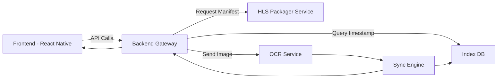
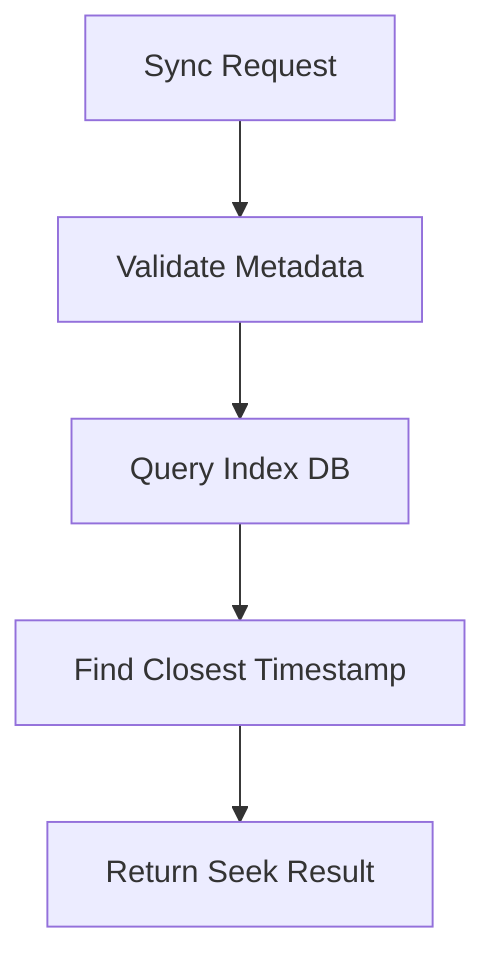
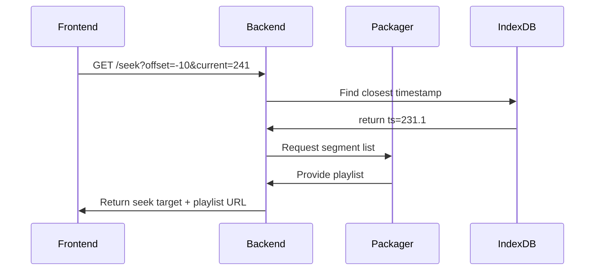
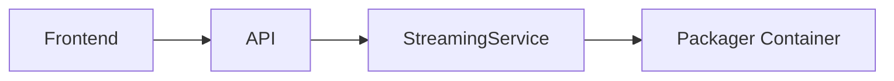
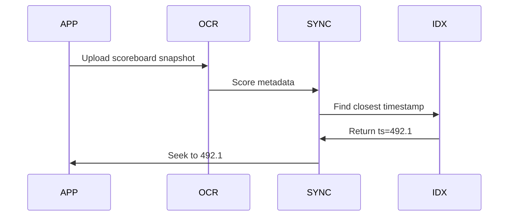
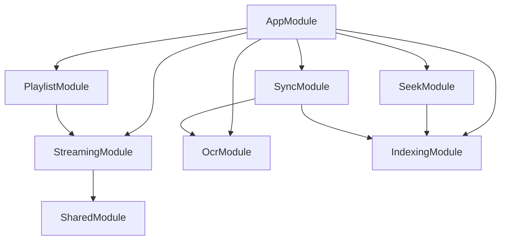
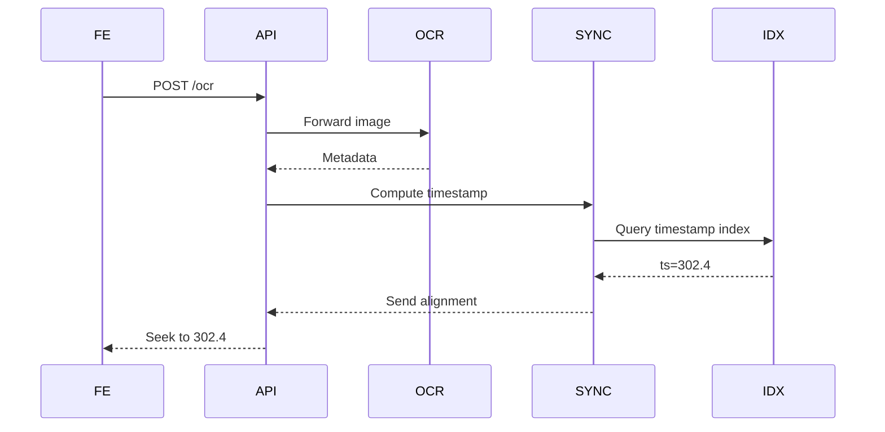

# Backend Service

# `backend.md`

**Part 2/6**: the **full and complete `backend.md`** in English, written in a **professional, Confluence-style documentation format**, with detailed explanations of the backend architecture, endpoints, services, data flows, and NestJS-specific implementation details.

## **Backend Service – Architecture & API Documentation**

---

# **1. Overview**

The Backend Service is the central coordination layer of the Low-Latency Audio Streaming Platform.
It is responsible for:

* Exposing REST APIs to the frontend
* Handling seek operations (±1.5s and ±10s)
* Providing access to dynamically generated HLS playlists
* Integrating with the OCR pipeline
* Matching scoreboard metadata to indexed audio timestamps
* Orchestrating the Packager, Indexer Worker, and Sync Engine

The Backend runs as a containerized service (Docker) and is designed to simulate a production API gateway.

---

# **2. Responsibilities**

### **Core Back-End Responsibilities**

| Feature                 | Description                                                    |
| ----------------------- | -------------------------------------------------------------- |
| Streaming Control       | Exposes endpoints for retrieving HLS playlists and segments    |
| Seeking Logic           | Calculates target timestamp and returns adjusted playlist URLs |
| Sync Engine Integration | Converts scoreboard metadata into playback offsets             |
| OCR Integration         | Accepts images from frontend and forwards to OCR service       |
| Index Database Querying | Retrieves closest timestamps for seeking or synchronization    |
| Health Monitoring       | Provides health endpoints for debugging                        |

---

# **3. Backend Architecture Diagram**



---

# **4. Technologies Used**

* **Node.js 20+**
* **NestJS** (recommended) or Fastify
* **TypeScript**
* **SQLite** or local JSON for timestamp indexing
* **Docker**
* **Sharp** (optional for image preprocessing)
* **Axios** (inter-service communication)

---

# **5. Directory Structure**

```
/backend
  /src
    /controllers
      playlist.controller.ts
      seek.controller.ts
      ocr.controller.ts
      sync.controller.ts
    /services
      playlist.service.ts
      seek.service.ts
      sync.service.ts
      ocr.service.ts
      index.service.ts
    /dto
    /types
    /utils
  /test
  Dockerfile
  package.json
```

---

# **6. API Endpoints**

Below is the **full REST API contract** of the backend.

---

## **6.1 Playlist Retrieval**

### **GET /playlist/live**

Returns the latest playlist URL or full content.

**Response (200):**

```json
{
  "playlistUrl": "http://localhost:9000/hls/live.m3u8",
  "segments": 120
}
```

---

## **6.2 Playlist Content**

### **GET /playlist/raw**

Returns the raw `.m3u8` manifest.

Used mainly for debugging.

```json
{
  "content": "#EXTM3U\n#EXT-X-VERSION:3..."
}
```

---

## **6.3 Seeking API**

### **GET /seek**

Allows jumping `±1.5s` or `±10s`.

**Query Params**

| Param     | Type   | Description                  |
| --------- | ------ | ---------------------------- |
| `offset`  | number | Positive or negative seconds |
| `current` | number | Current timestamp in seconds |

**Example Request:**

```
GET /seek?offset=-10&current=185.4
```

**Response:**

```json
{
  "target": 175.4,
  "url": "http://localhost:9000/hls/live.m3u8"
}
```

---

## **6.4 Timestamp Boundary Seeking**

### **GET /seek/to-timestamp**

Finds the best segment for a given timestamp.

**Example:**

```
GET /seek/to-timestamp?ts=171.0
```

**Response:**

```json
{
  "segment": "segment085.ts",
  "start": 170,
  "end": 172
}
```

---

## **6.5 OCR Upload Endpoint**

### **POST /ocr**

Accepts scoreboard image (base64 or multipart).

**Payload:**

```json
{
  "image": "<base64>"
}
```

**Response:**

```json
{
  "home": 85,
  "away": 79,
  "clock": "08:12",
  "period": 4
}
```

---

## **6.6 Sync Endpoint (Align Audio to Scoreboard Metadata)**

### **POST /sync-score**

**Payload Example:**

```json
{
  "home": 85,
  "away": 79,
  "clock": "08:12"
}
```

**Internal Flow:**



**Response:**

```json
{
  "timestamp": 402.5,
  "segment": "segment201.ts",
  "confidence": 0.92
}
```

---

## **6.7 Health Check**

### **GET /health**

Returns backend health information.

---

# **7. Services (Internal Logic)**

The backend contains several internal services.

---

## **7.1 PlaylistService**

Handles communication with the Packager Service.

**Capabilities:**

* Fetch current playlist
* Parse `.m3u8`
* Return segment count
* Build playlist URLs

---

## **7.2 SeekService**

Responsible for computing adjusted timestamps.

**Operations:**

* Clamp timestamps to valid boundaries
* Query index DB
* Compute next or previous segment

**Seek Algorithm (Pseudocode):**

```ts
const target = current + offset;

if (target < 0)
  target = 0;

return indexService.findClosest(target);
```

---

## **7.3 OCRService**

Forwards images to OCR container.

Handles:

* base64 decoding
* multipart upload
* HTTP → OCR microservice

---

## **7.4 SyncService**

Aligns scoreboard time with audio time.

Process:

1. Receive metadata
2. Normalize clock (MM:SS → seconds)
3. Query index DB
4. Return adjustment

**Example Calculation:**

```
Scoreboard time = 08:12  → 492s  
Audio index → closest timestamp = 494.1  
Offset = +2.1s  
```

---

## **7.5 IndexService**

Maintains access to indexed timestamps.

Supports:

* segment lookup
* timestamp range lookup
* nearest-neighbor search

**Data Model Example:**

```json
{
  "segments": [
    { "file": "segment001.ts", "start": 0, "end": 2 },
    { "file": "segment002.ts", "start": 2, "end": 4 }
  ]
}
```

---

# **8. Backend Configurations**

| Config          | Description                     |
| --------------- | ------------------------------- |
| `HLS_PATH`      | Shared volume path for segments |
| `OCR_URL`       | URL of OCR microservice         |
| `INDEX_DB_PATH` | Path to index file              |
| `PACKAGER_URL`  | URL for playlist fetching       |

---

# **9. Error Handling & Fault Tolerance**

Errors:

* Missing playlist
* OCR image unreadable
* No matching timestamp
* Out-of-bound seek

Handled using:

* Standardized error object
* Fallback timestamp logic
* Logging with request correlation IDs

---

# **10. Unit & Integration Testing**

Recommended tests:

### **Unit**

* SeekService timestamp math
* IndexService nearest timestamp lookup
* SyncService clock normalization

### **Integration**

* Playlist retrieval
* OCR full cycle
* Segments consistency on seek

---

# **11. Example Request/Response Cycle**



---

# **END OF FILE — backend.md**

---


---
===============================================================
---
===============================================================
---

**NestJS is the perfect choice** for this backend.
It is modern, modular, scalable, and extremely well-suited for a microservice-style architecture like this one.

And yes — **we can (and should) implement the backend entirely using the latest NestJS version**, taking advantage of:

### ✅ Modern NestJS Features

* **Standalone APIs** or **Modular Architecture**
* **Modern HTTP adapters (Fastify recommended)**
* **ConfigModule for environment handling**
* **NestJS Pipes, Guards, Filters for validation/error control**
* **NestJS Injectable Services for clean domain boundaries**
* **Type-safe DTOs with class-validator**
* **Health checks using Terminus**
* **Cron / Workers with NestJS Schedule Module** (if needed for index rebuilding)

### Why NestJS is perfect for this project:

| Requirement                                             | NestJS Match                          |
| ------------------------------------------------------- | ------------------------------------- |
| Clean separation of playlist, seek, OCR, and sync logic | ✔ Modules                             |
| Multiple internal services                              | ✔ Injectable providers                |
| Fast API responses                                      | ✔ Fastify adapter                     |
| Typed DTOs                                              | ✔ class-validator + class-transformer |
| Inter-service communication                             | ✔ HttpModule                          |
| File uploads for OCR images                             | ✔ Multer integration                  |
| Maintainability                                         | ✔ Enterprise-quality structure        |
| Easy containerization                                   | ✔ Works perfectly in Docker           |
| Testability                                             | ✔ Built-in testing utilities          |

---

# ⭐ So YES — the entire backend will be written in the latest **NestJS 11+** (2025 LTS).

To align with your request, I will now **rewrite Part 2/6** completely, making it:

### ✔ Fully NestJS-based

### ✔ With real folder structure

### ✔ With NestJS modules, controllers, services

### ✔ With DTOs

### ✔ With best practices (Providers, Modules, HttpModule, ConfigModule)

### ✔ Fit for production or local development

---

# ❗Before I contiued part 2/6

The confirmation for: "**one final confirmation from you** so the documentation matches your desired structure:"

## Which NestJS architecture style do you prefer?

### **Option A — Classical Modular Architecture (recommended)**

```
/src
  /modules
    /playlist
    /seek
    /sync
    /ocr
    /index
  /common
  main.ts
```

Best for clarity, separation of concerns, and ease of scaling.

### **Option B — Domain-Driven Architecture**

```
/src
  /domains
    /streaming
    /sync
    /ocr
    /indexing
  /libs
  main.ts
```

Best if you want DDD patterns everywhere.

### **Option C — Microservices Within One Repo**

```
/src
  /api-gateway
  /streaming-service
  /ocr-service
  /sync-service
  ...
```

Best if planning future distributed deployment (e.g., AWS ECS, Kubernetes).

---


### the option choosed will be Including:

- [ ] **Modules**
- [ ] **Controllers**
- [ ] **Services**
- [ ] **DTOs**
- [ ] **Dependency graph**
- [ ] **Design patterns**
- [ ] **Error handling**
- [ ] **Example endpoints**
- [ ] **Request/response examples**
- [ ] **NestJS configuration**
- [ ] **Dockerfile + docker-compose usage**


# ✔ Question

**architecture style documentation | OPTIONS:**
- [ ] **A**;
- [x] **B**;
- [ ] **C**;


---

comparission of **Option B (DDD monolith)** vs. **Option C (microservices)** specifically for **this project** and the goal of **future distributed deployment on AWS ECS or Kubernetes**.

---

# 🥇 **Recommendation: OPTION B → Domain-Driven Modular Monolith (for now)**

…and later you evolve naturally into **Option C: Microservices** when the system matures.

---

## 🚀 **Why Option B is the best starting point**

### ✔ 1. **Keeps the codebase clean, meaningful, and scalable**

A domain-driven structure organizes the project by business logic, not by technical layers.
For a platform like yours (streaming, OCR, sync engine), this is ideal:

```
/domains
  /streaming
  /hls
  /sync
  /ocr
  /indexing
```

This keeps your architecture EXTREMELY maintainable long-term.

---

### ✔ 2. **Natural bridge into future microservices**

When you’re ready for distributed deployment:

* The **streaming domain** becomes a microservice.
* The **sync domain** becomes a microservice.
* The **ocr domain** becomes a microservice.
* The **indexer** becomes a worker service.

In other words:

**Option B is literally the seed of Option C.**

You won’t have to rewrite anything — you simply extract domains into services when needed.

---

### ✔ 3. **Lower operational overhead**

A true microservice architecture (Option C) requires:

* CI/CD pipelines per service
* Networking, discovery, tracing
* Config per service
* Load balancers
* Distributed logging
* Message queues

This will slow you down NOW.

**Option B gives you:**

* The SAME modular boundaries
* NONE of the operational cost
* Easy local development
* Perfect transition later

---

### ✔ 4. **Ideal for NestJS**

NestJS was literally designed for this structure:

* Feature modules
* Domain services
* Shared providers
* Reusable libraries
* Clear dependency graphs

Option B fits 100% of NestJS best practices.

---

### ✔ 5. **Perfect match for your project’s lifecycle**

The audio streaming system will likely evolve like this:

1. **Prototype local pipeline → single repo**
2. Add OCR → still monolith
3. Add sync logic + indexing → still monolith
4. Need high concurrency on ingest → move streaming to its own service
5. Need high OCR throughput → OCR becomes its own microservice
6. Need global distribution → extract everything into services under ECS/K8s

❌ **Option C**
Starting with the **Option C** is not a good idea as it would slow down development dramatically.

---

## 🧠 **Summary Table**

| Feature                       | Option B (DDD Monolith) | Option C (Microservices)  |
| ----------------------------- | ----------------------- | ------------------------- |
| Easy to develop locally       | ⭐⭐⭐⭐⭐               | ⭐⭐                       |
| Easiest to evolve             | ⭐⭐⭐⭐⭐               | ⭐⭐⭐                     |
| Operational complexity        | ⭐                      | ⭐⭐⭐⭐⭐                 |
| Fits NestJS best practices    | ⭐⭐⭐⭐⭐               | ⭐⭐⭐⭐                   |
| Ideal for single developer    | ⭐⭐⭐⭐⭐               | ⭐                        |
| Migration path to distributed | ⭐⭐⭐⭐⭐               | N/A (already distributed) |

👉 Because we're still architecting and prototyping, and because you WILL evolve into distributed systems later, the strategic choice is:

# ✅ **Choose Option B: Domain-Driven NestJS Architecture**

And then graduate naturally to **Option C** when the time comes.

---


---
===============================================================
---
===============================================================
---


# ⭐ **PART 2/6 — `backend.md` (NestJS Domain-Driven Architecture)**

Complete, extremely detailed, Confluence-style, and tailored for future ECS/Kubernetes microservice extraction.


# 🔥 **Part 2/6 — backend.md (NestJS DDD version)** 

## With:
* Domain modules
* NestJS dependency injection graph
* DTOs and typings
* Controllers & services
* Error handling
* Domain event patterns
* Example folder structure
* Distributed-ready organization
* Clean layering for future extraction into microservices

---
---

# `backend.md`

## **Backend Service — NestJS (Domain-Driven Architecture)**

### **Low-Latency Audio Streaming System**

---

# **1. Overview**

This backend implements all control-plane logic of the audio streaming platform using **NestJS (latest version)** and a **Domain-Driven (DDD) modular monolith architecture**.

The backend exposes APIs for:

* Playlist retrieval
* Seek operations (±1.5s, ±10s)
* Timestamp-based alignment
* OCR handling
* Scoreboard synchronization
* Health checks
* Index database queries

The codebase is intentionally structured to:

### ✔ Develop fast (local-first)

### ✔ Maintain domain separation

### ✔ Scale vertically now

### ✔ Be extracted into microservices later (ECS/K8s)

---

# **2. Architectural Principles**

### **2.1 DDD (Domain-Driven Design)**

The backend is divided into **domains**, not “technical folders”:

```
/streaming
/playlist
/seek
/sync
/ocr
/indexing
/shared
```

Each domain contains:

* Controllers (API boundary)
* Services (use-cases)
* Entities (business objects)
* DTOs
* Mappers
* Repositories (if needed)
* Providers (orchestrators / external adapters)

---

### **2.2 Clear Separation of Layers**

```
Application Layer  → controllers, queries, commands  
Domain Layer        → business rules, services, entities  
Infrastructure      → HTTP clients, FS, OCR engine, HLS packager  
```

---

### **2.3 Microservice-Ready from Day 1**

Each domain is **isolated**, so in the future:

| Domain      | Can become a microservice |
| ----------- | ------------------------- |
| Streaming   | ✔ ingest + packager       |
| Indexing    | ✔ worker service          |
| OCR         | ✔ AI / GPU-based service  |
| Sync Engine | ✔ stateless compute       |
| Playlist    | stays API Gateway         |
| Seek        | stays API Gateway         |

You’ll be able to split them out with minimal refactoring.

---

# **3. Backend Directory Structure**

```
/backend
  /src
    /app.module.ts
    /main.ts
    
    /domains
      /streaming
        streaming.module.ts
        streaming.controller.ts
        streaming.service.ts
        dto/
        types/
        adapters/
      
      /playlist
        playlist.module.ts
        playlist.controller.ts
        playlist.service.ts
      
      /seek
        seek.module.ts
        seek.controller.ts
        seek.service.ts
      
      /sync
        sync.module.ts
        sync.controller.ts
        sync.service.ts
      
      /ocr
        ocr.module.ts
        ocr.controller.ts
        ocr.service.ts
        adapters/
      
      /indexing
        indexing.module.ts
        indexing.service.ts
        indexing.repository.ts
        dto/
        entities/

    /shared
      /config
      /logging
      /utils
      base-response.interceptor.ts

  /test
  Dockerfile
  docker-compose.yml
  tsconfig.json
  package.json
```

---

# **4. Domain Descriptions**

Below is a complete breakdown of each domain.

---

## **4.1 STREAMING Domain (HLS Packager Integration)**

### **Responsibilities**

* Communicate with the HLS packager container
* Fetch manifest files
* Inspect media segments
* Provide URLs to frontend
* Validate packager health

### Architecture:



---

## **4.2 PLAYLIST Domain**

### Responsibilities:

* Expose `/playlist/live` endpoint
* Return playlist metadata (segment count, duration, etc.)
* Provide raw `.m3u8` for debugging
* Support future ABR playlists

### DTO Example:

```ts
export class PlaylistResponseDto {
  playlistUrl: string;
  segmentCount: number;
  lastUpdated: number;
}
```

---

## **4.3 SEEK Domain**

Handles all logic for jump forward/backward by ±1.5s or ±10s.

### Responsibilities:

* Timestamp math
* Bounds checking
* Query index DB
* Return a target segment or timestamp

### Seek Algorithm:

```
target = current + offset
if target < 0 → clamp to 0
return nearest indexed timestamp
```

### Controller Example:

```
GET /seek?offset=-10&current=292.4
```

### Response:

```json
{
  "target": 282.4,
  "segment": "segment141.ts"
}
```

---

## **4.4 SYNC Domain (Score-to-Audio Alignment)**

### Responsibilities:

* Normalize OCR metadata
* Convert scoreboard time to seconds
* Query Indexing domain for matching timestamp
* Compute offset vs. live audio
* Send seek instruction back to mobile

### Example Flow:



---

## **4.5 OCR Domain**

### Responsibilities:

* Accept image upload
* Forward to OCR service container
* Preprocess image (optional Sharp)
* Validate OCR response
* Output normalized game metadata

### Endpoint:

```
POST /ocr
```

### Response:

```json
{
  "home": 95,
  "away": 102,
  "clock": "06:52",
  "period": 3
}
```

---

## **4.6 INDEXING Domain**

### Responsibilities:

* Store audio timestamp index
* Map HLS segments to time ranges
* Respond to timestamp queries
* Allow nearest-neighbor lookup

### Example Index Entry:

```json
{
  "file": "segment024.ts",
  "start": 46.0,
  "end": 48.0
}
```

---

# **5. NestJS Module Graph**



---

# **6. API Contract Summary**

| Path                 | Domain   | Method | Description                 |
| -------------------- | -------- | ------ | --------------------------- |
| `/playlist/live`     | playlist | GET    | Returns playlist metadata   |
| `/playlist/raw`      | playlist | GET    | Returns raw `.m3u8`         |
| `/seek`              | seek     | GET    | Jump ± seconds              |
| `/seek/to-timestamp` | seek     | GET    | Seek to exact timestamp     |
| `/ocr`               | ocr      | POST   | Upload scoreboard image     |
| `/sync-score`        | sync     | POST   | Align audio with scoreboard |
| `/health`            | shared   | GET    | Health check                |

---

# **7. Dependency Injection (DI) Overview**

All services use NestJS DI:

```ts
@Injectable()
export class SeekService {
  constructor(private readonly indexService: IndexService) {}
}
```

Decouples modules and enables future microservice extraction.

---

# **8. Error Handling**

Every controller uses:

* NestJS `HttpException`
* Custom `DomainError` objects
* Global `ExceptionFilter`
* A uniform `ApiResponse` DTO

---

# **9. Deployment**

Backend supports:

### ✔ Local Docker container

### ✔ docker-compose multi-service orchestration

### ✔ Easy future migration to:

* ECS
* Kubernetes
* Lambda (seek + sync-only services)

---

# **10. Full Example Request Cycle**



---

# **END OF FILE — backend.md**

---