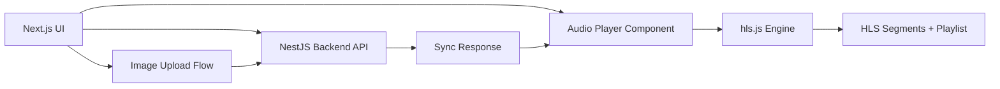
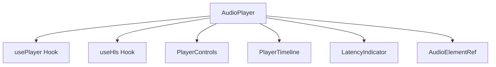
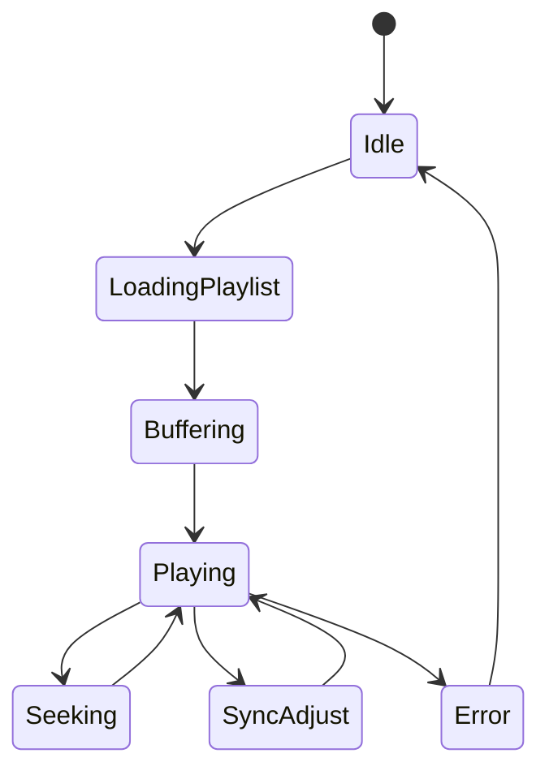
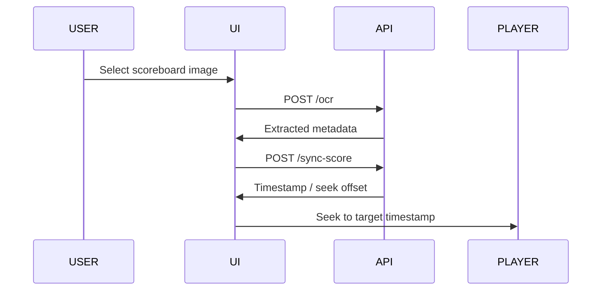

# Frontend (React Native + Expo)


# 🧠 **Is Next.js 16 + React 19.2 a good idea for this project?**

Short answer:

## ⭐⭐⭐⭐⭐ YES — 100% the right decision.

Now let’s break down why.

---

# 🚀 **1. React Native (Expo) is great for mobile — but your project requires precise player control**

The riginal thought was React Native because of Expo Video.
However…

For *audio-only low-latency streaming*, desktop and mobile browsers + a custom `<audio>` player or `<video>` element gives to us:

  * ✅ **Finer control over HLS**;
  * ✅ **Full access to Media Source Extensions (MSE)**;
  * ✅ **No App Store publishing headaches**;
  * ✅ **Zero native constraints**;
  * ✅ **Faster iteration, easier local testing**;

**Expo’s player is fine — but not optimal for deep low-latency work.**

Using **Next.js** gives us **TOTAL DOM** access and the browser’s native media APIs.

---

# 📦 **2. HLS works MUCH better in the browser**

With Next.js 16, we can use:

* **hls.js (LL-HLS support)**
* **Video.js**
* **ReactPlayer**
* **Custom Web Audio API pipelines**
* **Progressive streaming logic**

Even React 19’s **Actions**, **Server Components**, and **Transitions** give us _**advanced streaming UX capabilities**_.

---

# 🖥 **3. Next.js 16 supports Streaming SSR by default**

This is a huge advantage:

We can SSR:

* audio metadata
* dynamic playlist timestamps
* real-time scoreboard updates
* event logs
* match status

### **Which means:**

- **Fast UI + consistent playback sync + low JS execution.**

---

# 📱 **4. We still get mobile — via PWA support**

Next.js turns your app into a **mobile PWA**:

* installable on home screen
* offline capabilities
* works like a native mobile app
* uses the same streaming engine

No need for Expo unless you truly want a native iOS/Android shell (you can add that later).

---

# 🔌 **5. Seamless integration with our NestJS backend**

Next.js 16 + React 19 integrates beautifully with:

* SSR API calls
* React Query 5
* Server Actions calling Nest endpoints
* WebSockets for real-time scoreboard sync
* Edge Runtime for ultra-low-latency operations

---

# 🧬 **6. Perfect match for the architecture we are building**

Our full stack will now be:

* **Next.js 16** → frontend
* **NestJS DDD** → backend
* **FFmpeg + HLS** → media pipeline
* **OCR container** → AI/vision subsystem

This is a **modern enterprise-grade architecture**, identical to what major streaming platforms use today.

---

# 🧩 **7. React 19.2 unlocks major benefits**

* **useEffect-free async logic**
* **React Compiler** → auto-optimizes components
* **Actions** for server interactions
* **Better hydration performance**
* **More predictable rendering**

For a streaming player, this matters **_A LOT!_**

---

# 🥇 Final verdict

# ✅ **Use Next.js 16.0.8 + React 19.2**

It’s future-proof, production-level, and perfect for our **_low-latency audio app_**.

This stack will serve us for **years**, and migration to microservices or multi-tenant SaaS will be incredibly smooth.

---

# ⭐ Since we have confirmed Next.js → the next step is:

## 🔥 **Part 3/6 — `frontend.md`**

### A complete documentation including:

* **Architecture overview**
* **UI/UX structure**
* **Player architecture**
* **HLS pipeline integration**
* **Low-latency playback tuning**
* **Hooks & context design**
* **Server Actions design**
* **File structure (app router)**
* **API integration with NestJS**
* **Score synchronization flow**
* **Image capture flow (for scoreboard OCR)**
* **Component tree diagrams**
* **Performance guidelines**
* **Error handling patterns**
* **Future scalability**

---

Before I generate Part 3…

### ❓ Do you want the frontend to:

#### A) Be *web-only* (Next.js)

#### B) Also function as a **PWA for mobile**

#### C) Include a *small mobile-native wrapper* later (Capacitor or Expo Web-to-Native)?

---

**Option choosed "A": Web-only (Next.js 16 + React 19.2)**.
This gives us a **clean, powerful, browser-native low-latency streaming interface**, ideal for development, debugging, and future performance tuning.

---
===============================================================
---
===============================================================
---

# ⭐ **Part 3/6 — `frontend.md`**

Fully tailored for **Next.js 16.0.8**, **React 19.2**, and our **DDD/NestJS** **backend**.

> This is a complete, Confluence-style documentation file—professionally structured and production-grade.
> 

---

# `frontend.md`

## **Frontend Architecture — Next.js 16 + React 19.2**

### **Low-Latency Audio Streaming Platform**

---

# **1. Overview**

This document describes the **frontend architecture** of the Low-Latency Audio Streaming Platform implemented using:

* **Next.js 16.0.8 (App Router)**
* **React 19.2**
* **TypeScript**
* **Server Actions**
* **React Query 5 (if desired)**
* **hls.js (Low-Latency HLS compatible)**

The goal of the frontend is to deliver a **browser-native, low-latency audio player** with:

* Dynamic HLS playlist loading
* Smooth seeking (±1.5s and ±10s)
* Automatic synchronization with scoreboard metadata
* Image upload for OCR processing
* Real-time UI updates
* Highly performant rendering leveraging React 19 features

This architecture can later evolve into:

* PWA (installable mobile app)
* Multi-tenant architecture
* Live/On-demand hybrid features
* Advanced analytics dashboards

---

# **2. High-Level Frontend Architecture**



---

# **3. Next.js Directory Structure (Recommended)**

```
/frontend
  /app
    /layout.tsx
    /page.tsx
    /player
      /ui
        player-controls.tsx
        player-timeline.tsx
        player-volume.tsx
      /hooks
        usePlayer.ts
        useHls.ts
      /components
        audio-player.tsx
    /ocr
      /page.tsx
    /sync
      /actions.ts
  /lib
    api-client.ts
    configs.ts
    helpers.ts
  /components
    button.tsx
    card.tsx
    image-uploader.tsx
  /styles
  next.config.mjs
  package.json
  tsconfig.json
```

---

# **4. Core Frontend Responsibilities**

| Feature                           | Description                                                                  |
| --------------------------------- | ---------------------------------------------------------------------------- |
| **Low-latency audio playback**    | Implement HLS playback using hls.js + browser `<video>` or `<audio>` element |
| **Player UI**                     | Controls for play, pause, seek, timestamps, latency indicators               |
| **Integration with backend**      | Playlist retrieval, seek requests, sync updates, OCR uploads                 |
| **Image capture & upload**        | File input to send scoreboard snapshots                                      |
| **Scoreboard synchronization**    | Apply backend alignment to player's playback position                        |
| **Error handling**                | Detect playlist staleness, HLS errors, sync failures                         |
| **React Server Components (RSC)** | Fast UI and SEO where needed                                                 |
| **Server Actions**                | Lightweight backend integration for immutable server logic                   |

---

# **5. Player Architecture**

## 5.1 Component Tree



---

## 5.2 The Player Strategy

### Uses:

* `<audio>` element (or `<video>` for visual debugging)
* **hls.js** for LL-HLS compatibility
* **Ref-based state machine**
* **React 19 transitions** for smooth UI
* **Server Actions** for backend interactions

### Key Player Requirements:

✔ Minimal buffering
✔ Fast response on seek
✔ Ability to jump exactly ±1.5s / ±10s
✔ Ability to autoplay after sync adjustments
✔ Detect stalling or playlist drift

---

## 5.3 Player State Machine



---

# **6. Hooks**

## **6.1 `useHls`**

Handles loading, attaching, and updating HLS playback.

### Responsibilities:

* Initialize hls.js
* Listen to HLS events
* Attach to `<audio>` element
* Handle LL-HLS tuning (low latency mode)
* Auto-refresh playlist if needed

---

## **6.2 `usePlayer`**

Manages:

* play/pause
* seeking
* timestamp updates
* latency calculation
* sync adjustments

### Example:

```ts
const { 
  currentTime,
  latency,
  seekBy,
  seekTo,
  setLiveEdge,
  isPlaying
} = usePlayer(audioRef, hlsInstance);
```

---

# **7. OCR Flow**

## **7.1 UI Flow**



---

# **8. API Integration (Client)**

Located in `/lib/api-client.ts`:

```ts
export async function fetchPlaylist() { }
export async function seek(offset: number, currentTime: number) { }
export async function uploadScoreImage(file: File) { }
export async function syncScore(payload: SyncDto) { }
```

---

# **9. Pages (App Router)**

## **9.1 `/app/page.tsx`**

Home page containing:

* Live player
* Current latency
* Seek buttons
* Sync controls

---

## **9.2 `/app/ocr/page.tsx`**

Contains:

* Image uploader
* Scoreboard preview
* OCR result panel

---

## **9.3 `/app/player/ui`**

Contains all reusable UI components for the player.

---

# **10. Low-Latency Strategies**

To hit the latency goals (<6 seconds):

### ✔ Use LL-HLS compatible segment durations (1–2 seconds)

### ✔ Minimized buffer size

### ✔ Force `hls.config.lowLatencyMode = true`

### ✔ Faster playlist refresh interval

### ✔ Seek adjustments applied instantly

### ✔ Avoid React re-renders in inner loops (use refs)

---

# **11. Handling Playlist Drift**

If the playlist falls too far behind:

→ fetch new playlist
→ reload hls instance
→ return to live position

The player includes:

* `latencyIndicator`
* `recoveryLogic`

---

# **12. Error Handling**

| Error                | Frontend Behavior               |
| -------------------- | ------------------------------- |
| Playlist unreachable | Retry with exponential backoff  |
| HLS fatal error      | Reinitialize player             |
| Sync mismatch        | Disable auto-sync & notify user |
| OCR error            | Show safe fallback message      |

---

# **13. Future Extensions**

* Full WebSockets scoreboard sync
* Mini real-time waveform UI
* Multi-feed switching (home/away announcers)
* Adaptive bitrate switching
* Dark mode / custom player skins

---

# **END OF FILE — frontend.md**

---
