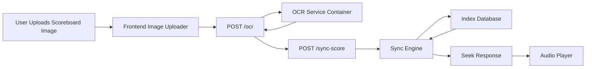
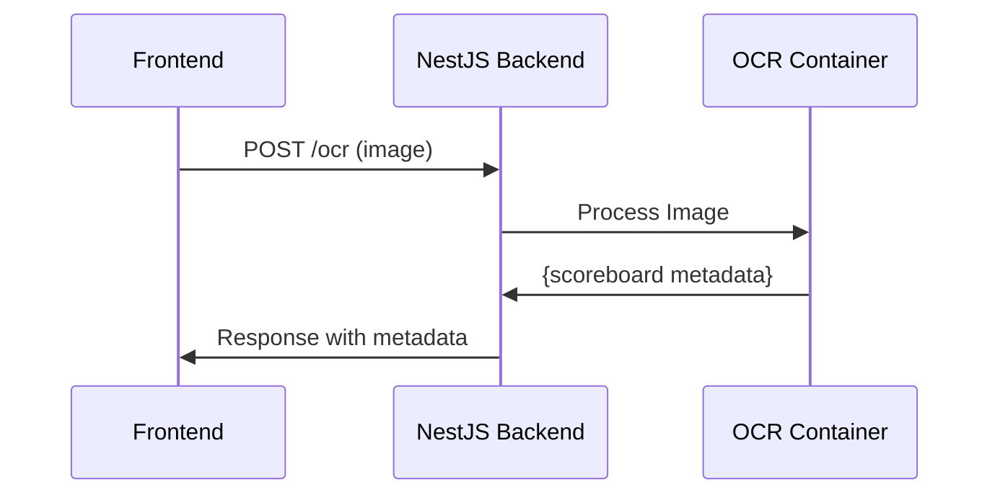
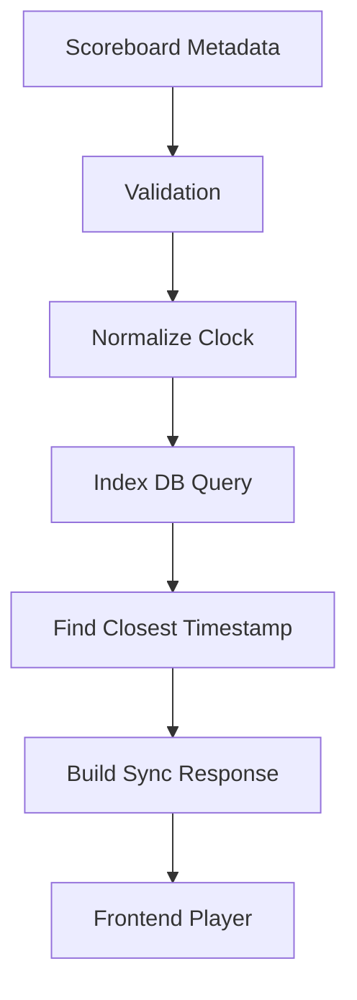
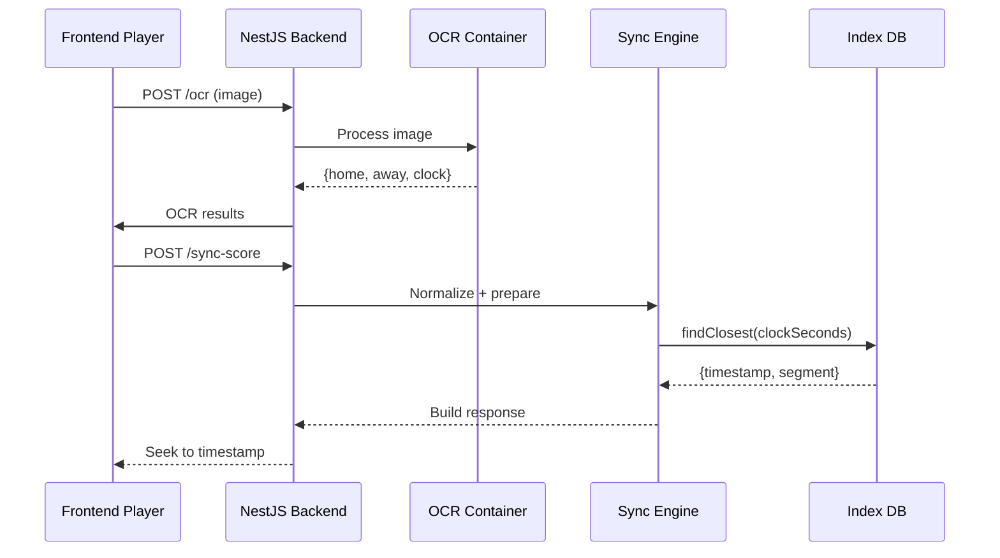

# OCR & Score Synchronization

## `ocr_sync.md`

## **OCR & Synchronization Engine — Architecture & Processing Pipeline**

### **Low-Latency Audio Streaming Platform**

---

# **1. Overview**

This document describes the complete OCR + Synchronization subsystem responsible for:

* Extracting scoreboard data (score, game clock, period/quarter)
* Normalizing the image using preprocessing
* Running OCR detection using Tesseract or OpenCV
* Validating and structuring the results
* Aligning the extracted scoreboard data with the audio timeline
* Producing a synchronization timestamp for the audio player

This subsystem is divided into two backend domains:

1. **OCR Domain** → Image → Metadata
2. **Sync Domain** → Metadata → Audio Timestamp

This allows extremely clean domain separation and future microservice extraction.

---

# **2. High-Level Architecture**



---

# **3. OCR Domain (Image → Scoreboard Metadata)**

The OCR domain transforms an uploaded scoreboard image into meaningful game metadata.

## **3.1 Responsibilities**

| Responsibility                     | Description                                           |
| ---------------------------------- | ----------------------------------------------------- |
| Preprocess image                   | Resize, normalize contrast, denoise, threshold        |
| Region-of-Interest (ROI) detection | Locate scoreboard area (optional OpenCV)              |
| OCR extraction                     | Extract numeric text (scores, time, period)           |
| Postprocessing                     | Clean and normalize results                           |
| Validation                         | Ensure values are plausible (e.g., time format MM:SS) |
| Output                             | Send structured metadata to Sync domain               |

---

# **4. OCR Pipeline (Steps)**



---

# **5. OCR Processing Logic**

## **5.1 Preprocessing (Sharp + OpenCV)**

These steps significantly improve OCR accuracy:

1. **Convert to grayscale**
2. **Apply bilateral filter** (denoise but preserve edges)
3. **Adaptive thresholding** (make numbers high-contrast)
4. **Resize upscale ×2 or ×3** (OCR loves big text)
5. **Crop Regions of Interest** (optional)

Example (pseudo):

```ts
const processed = sharp(image)
  .grayscale()
  .threshold(140)
  .resize({ width: originalWidth * 2 })
  .toBuffer();
```

---

## **5.2 OCR Extraction (Tesseract)**

The OCR container receives processed images and runs:

* LSTM OCR model
* Numeric whitelist (digits + colon)

Configuration example:

```
tesseract input.png stdout --psm 6 -c tessedit_char_whitelist=0123456789:
```

---

## **5.3 Post-Processing**

OCR output is noisy — so we apply cleanup rules:

### Example cleanup:

| Raw OCR Output  | Cleaned            |
| --------------- | ------------------ |
| `08:12.`        | `08:12`            |
| `Q4`            | `4`                |
| `SCORE 85 - 79` | `home=85, away=79` |

We apply regex:

```ts
const time = raw.match(/(\d{1,2}:\d{2})/);
const scores = raw.match(/(\d+)[^\d]+(\d+)/);
```

---

## **5.4 Output Schema**

```ts
interface OcrResult {
  home: number;
  away: number;
  clock: string;    // "MM:SS"
  period: number;   // Optional
  confidence: number;
}
```

---

# **6. Sync Domain (Scoreboard Metadata → Audio Timestamp)**

The Sync Engine is responsible for aligning visual scoreboard data to the audio timeline.

---

# **6.1 Responsibilities**

| Task                      | Description                                        |
| ------------------------- | -------------------------------------------------- |
| Normalize clock format    | Convert "MM:SS" → seconds                          |
| Retrieve index ranges     | Query Index Database for matching timestamp        |
| Find best audio timestamp | Map game time to audio time                        |
| Compute offset            | Difference between live audio and target timestamp |
| Return seek instruction   | Used by frontend to jump to the correct time       |

---

# **7. Sync Pipeline**



---

# **8. Timestamp Matching Logic**

The indexing domain stores:

```json
{
  "file": "segment201.ts",
  "start": 400.0,
  "end": 402.0
}
```

If the scoreboard clock says **08:12**, equal to:

```
8 min * 60 = 480
+ 12 sec = 492s
```

We find:

```
Closest timestamp in index → 491.8
```

Sync Engine returns:

```json
{
  "timestamp": 491.8,
  "segment": "segment246.ts",
  "confidence": 0.91
}
```

---

# **9. Validation Rules**

| Field      | Validation         |
| ---------- | ------------------ |
| score      | must be 0–200      |
| clock      | must match `MM:SS` |
| period     | 1–4 (basketball)   |
| confidence | > 0.75 recommended |

If validation fails:

→ The sync endpoint rejects the request with error code.

---

# **10. NestJS Implementation Details**

## **10.1 OCR Module**

```
/domains/ocr
  ocr.module.ts
  ocr.controller.ts
  ocr.service.ts
  adapters/
```

### Controller Endpoint:

```
POST /ocr
```

### Service Responsibilities:

* Communicate with OCR Docker container
* Handle file upload
* Transform image to buffer
* Return cleaned OCR result

---

## **10.2 Sync Module**

```
/domains/sync
  sync.module.ts
  sync.controller.ts
  sync.service.ts
```

### Controller Endpoint:

```
POST /sync-score
```

### Service Responsibilities:

* Normalize OCR metadata
* Query index database
* Compute best match
* Respond with timestamp

---

# **11. Detailed Flow Diagram**



---

# **12. Error Handling Strategy**

| Error Condition      | Behavior                              |
| -------------------- | ------------------------------------- |
| OCR unreadable       | Return `{ error: "OCR_UNCERTAIN" }`   |
| Clock invalid        | Return 400 Bad Request                |
| No timestamp match   | Return fallback timestamp (live edge) |
| Poor confidence      | Ask user to retake photo              |
| Index DB unavailable | Retry + fallback                      |

---

# **13. Future Enhancements**

### 🔮 Potential improvements:

* Use a **vision transformer (ViT)** model instead of Tesseract
* Add scoreboard template detection (team logos, styling)
* Train custom OCR models
* Real-time scoreboard tracking via WebSockets
* Use GPU acceleration for OCR container
* Leverage temporal OCR (video sequence instead of one photo)

---

# **14. Final Output Structure**

**OCR Output → Sync Engine → Player:**

```json
{
  "ocr": {
    "home": 102,
    "away": 98,
    "clock": "07:31",
    "confidence": 0.92
  },
  "sync": {
    "timestamp": 451.0,
    "segment": "segment226.ts",
    "offset": -2.3,
    "applyImmediately": true
  }
}
```

---

# **END OF FILE — ocr_sync.md**

---