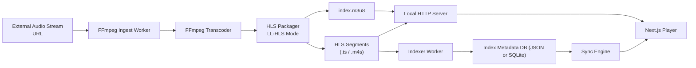
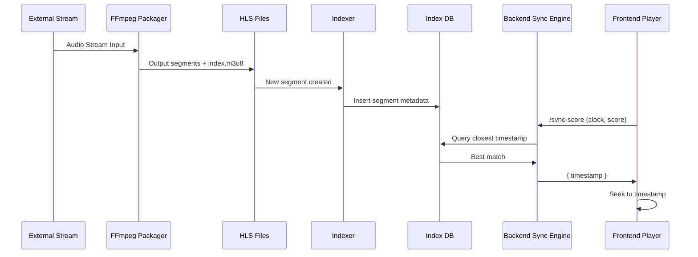

# Streaming Pipeline | FFmpeg Ingest

## `streaming_pipeline.md`

## **Streaming Pipeline Architecture — Low-Latency HLS + FFmpeg Indexing**

## **Low-Latency Audio Streaming Platform**

## 🔥 **`streaming_pipeline.md` — The Full Streaming & Indexing Pipeline Documentation**

### This is the piece that ties everything together:

* Audio ingest
* FFmpeg processing
* Low-Latency HLS generation
* Indexing every segment
* Backend alignment
* Local simulation of AWS MediaLive + MediaPackage
* Storage structure
* End-to-end architecture with diagrams

#### Written in **_enterprise-grade, Confluence-style documentation_**.

---

# **1. Overview**

This document describes the **complete audio streaming, ingestion, transcoding, packaging, and indexing pipeline** for the platform.

Since the cloud provider is not used locally, the system replicates:

* **AWS MediaLive** (real-time ingest → FFmpeg worker)
* **AWS MediaPackage** (HLS segment packager)
* **Indexing EC2 worker** (segment timestamp mapping)

All components run locally on Docker and orchestrate the following tasks:

| Stage                      | Task                                                                |
| -------------------------- | ------------------------------------------------------------------- |
| **1. Ingest**              | Receive external stream URL (MP3, AAC, HTTP radio stream, etc.)     |
| **2. Transcode**           | FFmpeg normalizes audio into uniform low-latency segments           |
| **3. Package**             | Segment into LL-HLS (`*.ts` or CMAF `*.m4s`)                        |
| **4. Playlist Generation** | `index.m3u8`, low-latency preload hints                             |
| **5. Indexing**            | Generate per-segment JSON metadata with audio timeline              |
| **6. Storage**             | Place segments + metadata into structured storage (`/storage/hls/`) |
| **7. Delivery**            | Frontend fetches via local HTTP server                              |
| **8. Sync**                | Backend maps scoreboard timestamps → segment timeline               |

---

# **2. High-Level Pipeline Diagram**



---

# **3. Ingest & Transcoding Layer**

This layer replaces **AWS MediaLive** locally.

---

## **3.1 Ingest Worker (FFmpeg)**

FFmpeg pulls the external audio stream:

```
ffmpeg -i http://external.stream.url \
       -vn \
       -acodec aac \
       -ar 48000 \
       -ac 2 \
       -f hls ...
```

### Purpose:

* Stabilize unreliable Internet radio streams
* Normalize codec, bitrate, and sample rate
* Remove video if existent
* Provide steady output for segmentation

---

## **3.2 Recommended FFmpeg Audio Parameters**

| Setting     | Value                         | Reason                                    |
| ----------- | ----------------------------- | ----------------------------------------- |
| Codec       | AAC (libfdk_aac if available) | Low latency & compatible with browsers    |
| Sample Rate | 48 kHz                        | Standard for broadcast-quality audio      |
| Channels    | 2 (Stereo)                    | Better UX + consistent waveform alignment |
| Bitrate     | 96–128 kbps                   | Good compromise between latency & quality |

---

# **4. HLS Packaging Layer (Local MediaPackage Simulation)**

This layer replaces **AWS MediaPackage**.

---

## **4.1 LL-HLS Segmenting Configuration**

To enable seeking with very low latency (<6 seconds), use:

```
-hls_time 2 \
-hls_playlist_type event \
-hls_flags independent_segments+delete_segments+append_list \
-hls_segment_type mpegts \
```

### Segment Duration

```
-hls_time 2
```

Produces ~2-second segments.
Good compromise for:

* Stability
* Low latency
* Smooth seeking
* Accurate indexing

---

## **4.2 Full FFmpeg Command (LL-HLS)**

```
ffmpeg -i http://external.stream.url \
  -c:a aac -b:a 128k -ar 48000 -ac 2 \
  -f hls \
  -hls_time 2 \
  -hls_list_size 10 \
  -hls_flags independent_segments+split_by_time \
  -hls_segment_filename "/storage/hls/segment%03d.ts" \
  "/storage/hls/index.m3u8"
```

### Notes:

✔ `independent_segments` ensures browser seeks don’t break.
✔ `split_by_time` ensures segments align tightly with real time.
✔ Using `.ts` segments instead of CMAF keeps everything simpler locally.

---

# **5. Playlist Generation**

A generated LL-HLS playlist looks like:

```
#EXTM3U
#EXT-X-VERSION:7
#EXT-X-TARGETDURATION:2
#EXT-X-MEDIA-SEQUENCE:201
#EXTINF:2.000,
segment201.ts
#EXTINF:2.000,
segment202.ts
...
```

---

# **6. Indexing Layer (Critical for Sync)**

This layer replaces the custom EC2 instance from the original architecture.

The **Indexing Worker** runs in parallel with FFmpeg.

---

## **6.1 What the Indexer Does**

For each segment generated:

* Compute real audio time offset
* Store:

  * segment filename
  * start timestamp (seconds)
  * end timestamp (seconds)
  * creation time
  * sequence number

### Example index entry:

```json
{
  "sequence": 201,
  "segment": "segment201.ts",
  "start": 400.0,
  "end": 402.0,
  "duration": 2.0,
  "createdAt": "2025-12-09T15:55:00Z"
}
```

---

## **6.2 Index Storage Options**

| Option     | Pros                             | Cons                       |
| ---------- | -------------------------------- | -------------------------- |
| JSON files | Simple, easy to debug            | Not ideal for concurrency  |
| SQLite     | Fast, structured, easy local dev | Requires schema management |
| Redis      | Real-time, high performance      | Requires separate service  |
| PostgreSQL | Future proof                     | Most overhead              |

**Recommended for local development: SQLite**.

---

## **6.3 Index Database Schema (SQLite)**

```sql
CREATE TABLE segments (
  id INTEGER PRIMARY KEY AUTOINCREMENT,
  sequence INTEGER NOT NULL,
  filename TEXT NOT NULL,
  start REAL NOT NULL,
  end REAL NOT NULL,
  duration REAL NOT NULL,
  created_at TEXT NOT NULL
);
```

---

# **7. Complete End-to-End Pipeline Flow**



---

# **8. Local Folder Structure for Streaming Storage**

```
/storage
  /hls
    index.m3u8
    segment000.ts
    segment001.ts
    segment002.ts
  /index
    segments.sqlite
    index-dump.json (optional)
```

---

# **9. Local Docker Orchestration**

Example `docker-compose.yml` services:

* **ffmpeg-worker** → runs ingest + hls packaging
* **indexer** → watches file system for new segments
* **api-backend** → NestJS backend
* **frontend** → Next.js 16
* **storage** → local volume

---

# **10. Low-Latency Optimization Checklist**

| Optimization                               | Purpose                        |
| ------------------------------------------ | ------------------------------ |
| Reduce segment duration (2s)               | Lower end-to-end delay         |
| Use independent segments                   | Easier browser seeking         |
| Keep playlist small (10 entries)           | Faster refresh                 |
| Serve HLS segments over HTTP/1.1 or HTTP/2 | Lower overhead                 |
| Avoid transcoding during playback          | Pre-transcode everything       |
| Use “live edge” seeking in player          | Always stay close to real-time |

---

# **11. Future Enhancements**

🔮 **Real LL-HLS (CMAF) Support**
Using `.m4s` segments + preload hints.

🔮 **Event Message Stream (EMSG)**
Embed real-time metadata inside segments.

🔮 **Multi-bitrate adaptive streaming (ABR)**
Useful if you plan video or higher-fidelity audio.

🔮 **Global distribution**
Using CDN caching layers (Cloudflare/Akamai).

🔮 **Automatic ingest failover**
Multiple external stream URLs for resilience.

---

# **12. Final Output Flow Summary**

| Stage        | Output                       |
| ------------ | ---------------------------- |
| Ingest       | Stable PCM/AAC audio         |
| Transcode    | Optimized low-latency AAC    |
| HLS Packager | Segments + playlist          |
| Indexer      | Segment metadata             |
| Sync Engine  | Timestamp mapping            |
| Player       | Low-latency audio experience |

---

# **END OF FILE — streaming_pipeline.md**

---